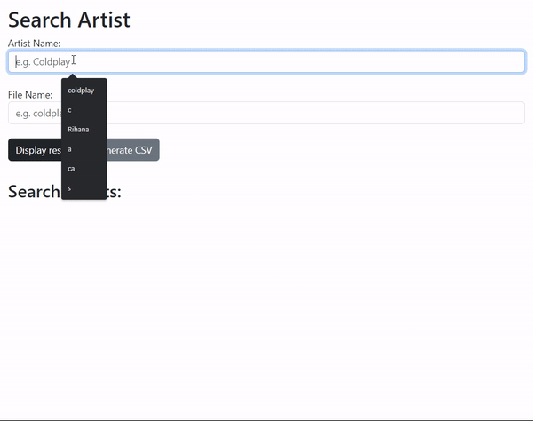
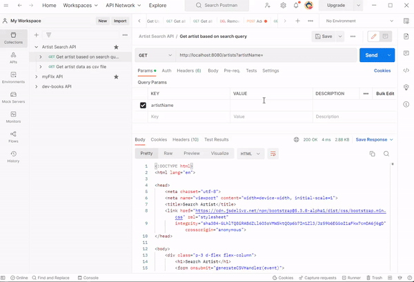
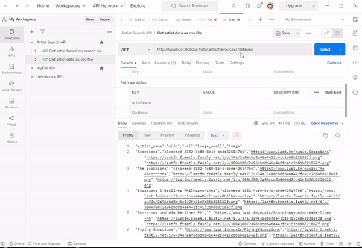

# Artist Search - RESTful API

API Documentation: https://documenter.getpostman.com/view/24037989/2s93CSprTf#71e5231c-2d56-43c8-897b-599a8e4cc570
The endpoints can be tested using Postman.

## Features

- Search for an artist by name based on the service provided by [artist.search](https://www.last.fm/api/show/artist.search), and return all the
  results for this artist.
- Writes the result to a user-supplied CSV filename.
- The CSV file includes the following information (name, mbid, url, image_small,
  image)
- If no results are returned from the endpoint, retrieve random artist names from a JSON dictionary source file.

## Built with

- Node.js
- Express

## Project Dependencies

- express
- axios
- morgan
- body-parser
- json2csv

## How to get started and run the project

1.  Clone the repository...
    `git clone https://github.com/minhajislam674/artist-search-api.git`
2.  Install all the project dependencies by using the command below.
    `npm install`
3.  Run the server by using the command below.
    `npm start` or `node index.js`

4.  Go to http://localhost:8080/ to interact with the API.
    

5.  Open Postman to test the API endpoints.

- When we access the end point on http://localhost:8080/artists/, and pass value to artistName query params, we receive the JSON data with response status code of 200.
  

- When we access the end point on http://localhost:8080/artists/:artistName/csv/:fileName, and pass value to both path variables artistName and fileName, we receive the data in csv format with response status code of 200.
  
